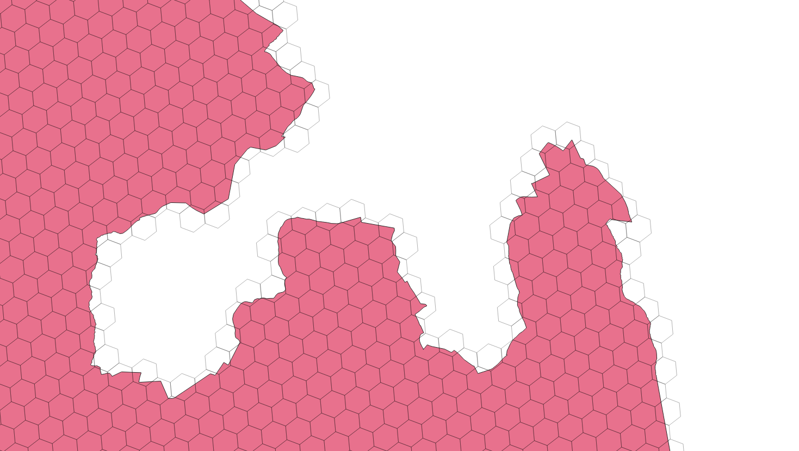
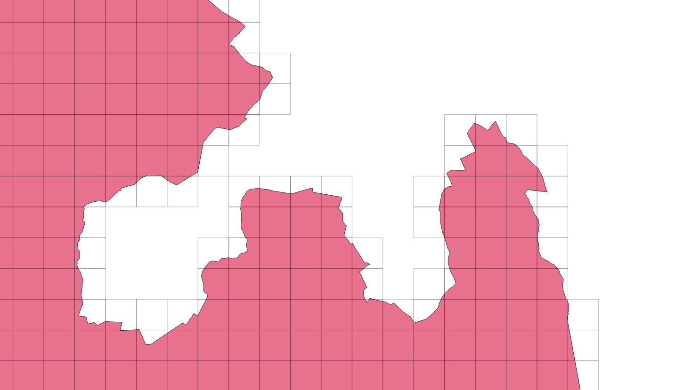

## Files

## H3 hexagons

  

Attributes:

* agglomeration_name: Name of the agglomeration
* agglomeration_country : country of the agglomeration
* h3index : ID of the hexagon

geopackage : 

* path : [data/h3_agglomeration_geopackage.zip](data/h3_agglomeration_geopackage.zip)

* coordinates systems : EPSG:4626 (lat/lng) , EPSG:3857 (web mercator [m]), EPSG:2056 (swiss coordinate [m])

geojson : 

* path : [h3_agglomeration_4326_geojson.zip](h3_agglomeration_4326_geojson.zip)

* coordinates system : EPSG:4626 (lat/lng) according to geojson specifications. 

:rotating_light: For processing using distance or area calculations, make sure to use a local metric coordinate system (or a library that is aware of that).

## Tiles

Tiles dimension is based on the official [swisstopo grid ](https://data.geo.admin.ch/ch.swisstopo.images-swissimage-dop10.metadata/shp/2056/ch.swisstopo.images-swissimage-dop10.metadata.zip) (1 km grid) divided by 2 to have 500 m long squares. 

Attributes :

* agglomeration_name: Name of the agglomeration
* agglomeration_country : country of the agglomeration
* index : extended ID according to the official swiss tile ID

Note that the output data has the same coverage as the Swiss official one (no squares are totally outside Switzerland).
